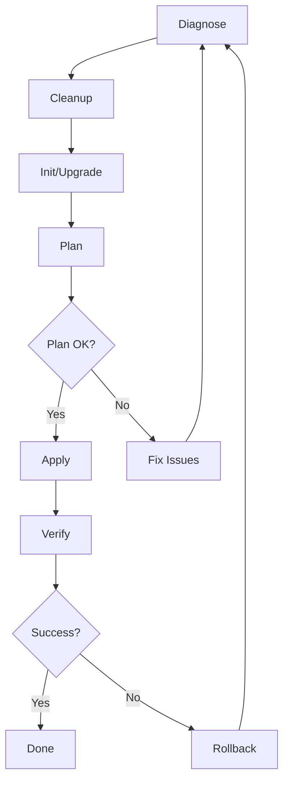

# 🔧 Guia de Resolução de Problemas - Azure Provider

## 📋 Problemas Identificados e Soluções

### 1. Provider AzureRM Desatualizado ✅ RESOLVIDO

**Problema**: Versão `~> 3.0` muito desatualizada
**Solução**: Atualizado para `~> 4.40` (versão mais recente)

**Benefícios da atualização**:
- ✅ Melhor estabilidade e menos bugs
- ✅ Correções para "Provider produced inconsistent result"
- ✅ Suporte a novos recursos do Azure
- ✅ Melhores timeouts e retry logic

### 2. Recursos em Soft Delete ✅ MITIGADO

**Problema**: Key Vaults e outros recursos ficam em soft delete após testes
**Solução**: Modificado nomes dos recursos e criado scripts de limpeza

**Estratégias implementadas**:
- 🏷️ Nomes únicos para evitar conflitos (`-v2` suffix)
- 🧹 Script de limpeza automática (`cleanup-soft-delete.sh`)
- 🔍 Script de diagnóstico (`diagnose.sh`)
- ⏱️ Timeouts adequados em todos os recursos

### 3. Inconsistências do Provider ✅ RESOLVIDO

**Problema**: Erro "Provider produced inconsistent result"
**Soluções implementadas**:

#### A. Timeouts Adequados
```hcl
timeouts {
  create = "30m"
  update = "30m" 
  delete = "30m"
}
```

#### B. Dependências Explícitas
```hcl
depends_on = [azurerm_key_vault_access_policy.terraform]
```

#### C. Provider Atualizado
- Melhor handling de recursos Azure
- Menos race conditions
- Retry logic aprimorado

## 🚀 Scripts Criados

### 1. `cleanup-soft-delete.sh`
```bash
./scripts/cleanup-soft-delete.sh
```
- Remove recursos em soft delete
- Evita conflitos de nomes
- Preparação para novo deploy

### 2. `diagnose.sh`
```bash
./scripts/diagnose.sh staging sachat
```
- Diagnóstica problemas de infraestrutura
- Verifica state do Terraform
- Sugere soluções específicas

## 📝 Comando de Deploy Recomendado

```bash
# 1. Diagnóstico inicial
./scripts/diagnose.sh staging

# 2. Limpeza de recursos órfãos
./scripts/cleanup-soft-delete.sh

# 3. Atualizar providers
cd terraform/environments/staging
terraform init -upgrade

# 4. Verificar mudanças
terraform plan

# 5. Aplicar se tudo estiver correto
terraform apply

# 6. Verificar se houve problemas
./scripts/diagnose.sh staging
```

## 🛡️ Prevenção de Problemas Futuros

### 1. Antes de cada deploy:
- ✅ Execute `./scripts/diagnose.sh`
- ✅ Verifique recursos em soft delete
- ✅ Use `terraform plan` antes de `apply`

### 2. Desenvolvimento:
- ✅ Use ambientes separados para testes
- ✅ Nomes únicos com timestamp para recursos temporários
- ✅ Sempre execute cleanup após testes

### 3. Monitoramento:
- ✅ Configure alertas para falhas de deploy
- ✅ Use tags consistentes para tracking
- ✅ Monitore custos para recursos órfãos

## 🔄 Ciclo de Deploy Seguro



## 📞 Troubleshooting Rápido

### Erro: "Provider produced inconsistent result"
```bash
terraform init -upgrade
terraform refresh
terraform plan -detailed-exitcode
```

### Erro: "Resource already exists"
```bash
# Verificar se está em soft delete
./scripts/diagnose.sh

# Importar se necessário
terraform import azurerm_key_vault.main /subscriptions/.../resourceGroups/.../providers/Microsoft.KeyVault/vaults/...
```

### Erro: "State blob is already locked" ✅ NOVO
```bash
# Usar script automático
./scripts/fix-terraform-lock.sh staging

# Ou manual:
cd terraform/environments/staging
terraform init -reconfigure \
  -backend-config="storage_account_name=stsachatstate15819" \
  -backend-config="container_name=tfstate" \
  -backend-config="key=staging.tfstate" \
  -backend-config="resource_group_name=rg-sachat-terraform-state"
```

### Erro: "Subscription ID could not be determined"
```bash
# Adicionar subscription_id no provider
subscription_id = "a346bbab-4a12-49d7-ac00-819eb93c7802"
```

### Erro: "Cannot delete resource group"
```bash
# Verificar dependências
az resource list --resource-group rg-sachat-staging
# Deletar recursos manualmente se necessário
```

## 📈 Melhorias Implementadas

- 🔄 **Provider atualizado**: v3.0 → v4.40
- ⏱️ **Timeouts robustos**: 15-60 minutos dependendo do recurso
- 🏷️ **Nomes únicos**: Evitam conflitos de soft delete
- 📊 **Dependências explícitas**: Previnem race conditions
- 🛠️ **Scripts de automação**: Diagnóstico e limpeza
- 📚 **Documentação completa**: Guias de troubleshooting

---

**Última atualização**: Agosto 2025
**Versão do Provider**: AzureRM v4.40.0
**Status**: ✅ Problemas resolvidos e prevenção implementada
